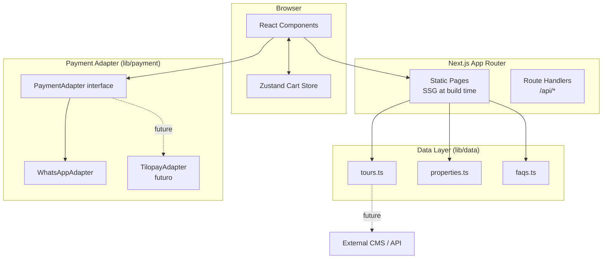
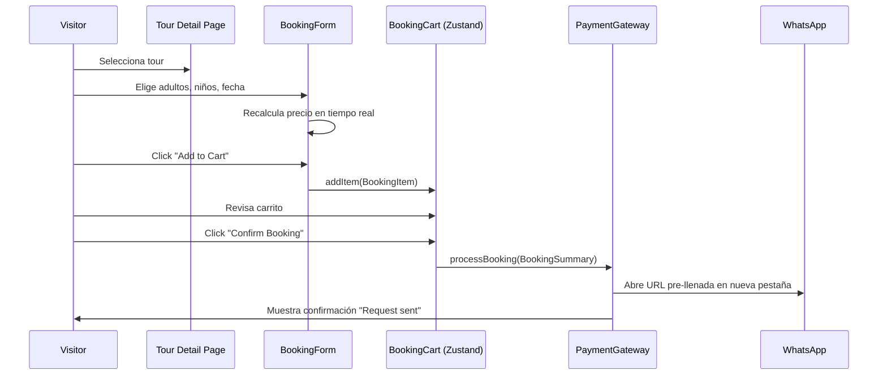

# Design Document: Guanacaste Tickets Website

## Overview

Guanacaste Tickets es un sitio web de tours y actividades en Guanacaste, Costa Rica, orientado a turistas extranjeros. Está construido con **Next.js 14 (App Router)** y desplegado en Vercel. El sitio combina generación estática (SSG) para páginas de tours con renderizado del lado del cliente para interacciones dinámicas como filtros, carrito de reservas y el flujo de booking.

El objetivo principal es convertir visitantes orgánicos (SEO en inglés) en reservas confirmadas a través de WhatsApp, con arquitectura preparada para integrar pasarelas de pago reales (Tilopay) en el futuro.

### Objetivos de diseño

- **Performance**: Lighthouse ≥ 80 en mobile; imágenes en WebP/AVIF; SSG para contenido estático.
- **SEO**: Metadata única por página, JSON-LD, sitemap.xml, Open Graph y Twitter Cards.
- **Escalabilidad**: Capa de datos desacoplada de la UI; adaptador de pagos reemplazable.
- **Accesibilidad**: Contraste ≥ 4.5:1, navegación por teclado, alt text en imágenes.
- **Mantenibilidad**: Design tokens centralizados, componentes reutilizables, TypeScript estricto.

---

## Architecture

### Stack tecnológico

| Capa | Tecnología |
|---|---|
| Framework | Next.js 14 (App Router) |
| Lenguaje | TypeScript 5 |
| Estilos | Tailwind CSS 3 + CSS Variables (design tokens) |
| Estado cliente | Zustand (carrito de reservas) |
| Formularios | React Hook Form + Zod |
| Imágenes | next/image (WebP/AVIF automático) |
| SEO | next/metadata API + JSON-LD manual |
| Testing | Vitest + React Testing Library + fast-check (PBT) |
| Despliegue | Vercel |

### Estructura de directorios

```
guanacaste-tickets/
├── app/                          # Next.js App Router
│   ├── layout.tsx                # Root layout (Header + Footer)
│   ├── page.tsx                  # Homepage
│   ├── tours/
│   │   └── [slug]/
│   │       └── page.tsx          # Tour detail page
│   ├── faq/
│   │   └── page.tsx
│   ├── contact/
│   │   └── page.tsx
│   ├── real-estate/
│   │   └── page.tsx
│   ├── sitemap.ts                # Dynamic sitemap
│   └── robots.ts                 # robots.txt
├── components/
│   ├── layout/
│   │   ├── Header.tsx
│   │   └── Footer.tsx
│   ├── home/
│   │   ├── HeroSection.tsx
│   │   ├── DealsSection.tsx
│   │   ├── WhySection.tsx
│   │   ├── TestimonialsSection.tsx
│   │   ├── AllToursSection.tsx
│   │   └── RealEstateSection.tsx
│   ├── tours/
│   │   ├── TourCard.tsx
│   │   ├── TourFilters.tsx
│   │   ├── TourGallery.tsx
│   │   └── ShareButtons.tsx
│   ├── booking/
│   │   ├── BookingForm.tsx
│   │   ├── ParticipantSelector.tsx
│   │   ├── BookingCart.tsx
│   │   └── BookingCartItem.tsx
│   ├── faq/
│   │   └── FAQAccordion.tsx
│   └── ui/                       # Primitivos reutilizables
│       ├── Button.tsx
│       ├── Badge.tsx
│       └── ...
├── lib/
│   ├── data/                     # Capa de datos (reemplazable por API)
│   │   ├── tours.ts
│   │   ├── properties.ts
│   │   └── faqs.ts
│   ├── payment/                  # Adaptador de pagos
│   │   ├── types.ts
│   │   ├── whatsapp-adapter.ts
│   │   └── index.ts
│   └── config.ts                 # Constantes globales (WhatsApp number, etc.)
├── store/
│   └── cart.ts                   # Zustand store para Booking_Cart
├── types/
│   └── index.ts                  # Interfaces TypeScript globales
├── styles/
│   └── globals.css               # Design tokens CSS variables
└── public/
    ├── images/
    └── data/                     # JSON estático de tours (data layer inicial)
```

### Diagrama de arquitectura



### Flujo de reserva



---

## Components and Interfaces

### Layout Components

**Header** (`components/layout/Header.tsx`)
- Sticky (`position: sticky; top: 0`), z-index elevado.
- Logo + nav links: Tours, Deals, Real Estate, Contact.
- Botón WhatsApp visible en desktop y mobile.
- Menú hamburguesa en mobile (< 768px).

**Footer** (`components/layout/Footer.tsx`)
- Links: Privacy Policy, Terms of Service.
- Social media links (Instagram, Facebook, TikTok).
- Información de contacto y número WhatsApp.

### Home Page Sections

**HeroSection**
- Imagen de fondo full-width con `next/image` (priority=true para LCP).
- H1 con "Explore Guanacaste", subtítulo, CTA button → `/tours`.

**DealsSection**
- Grid de mínimo 3 `TourCard` con `featured: true`.
- Badge "Featured Deal" en color terciario `#FFB347`.

**WhySection**
- Grid de 3+ value propositions con icono SVG, título y descripción.
- Fondo con color secundario `#2D5A27` o variante clara.

**TestimonialsSection**
- Lista de testimonios; carousel horizontal en mobile (< 768px) con CSS scroll-snap.

**AllToursSection**
- `TourFilters` + grid de `TourCard`.
- Filtrado y búsqueda en cliente (sin recarga de página).

**RealEstateSection**
- Grid de mínimo 2 property listings.

### Tour Components

**TourCard** (`components/tours/TourCard.tsx`)
```tsx
interface TourCardProps {
  tour: Tour;
  variant?: 'featured' | 'standard';
}
```
- Imagen, título, descripción (max 120 chars), precio, CTA.
- Badge "Free Cancellation" si `tour.cancellationPolicy.freeCancellation`.
- Badge "Featured" si `variant === 'featured'`.

**TourFilters** (`components/tours/TourFilters.tsx`)
- Search input (filtra por título y descripción).
- Category filter (chips/tabs).
- Price range slider (min/max USD).
- Duration filter.
- Difficulty filter.
- Sort selector (price asc/desc, popularity, duration).
- Todo el estado de filtros vive en `useState` local; filtra el array en memoria.

### Booking Components

**BookingForm** (`components/booking/BookingForm.tsx`)
- Usa React Hook Form + Zod para validación.
- Contiene `ParticipantSelector` y date picker.
- Calcula precio total en tiempo real.
- Botones: "Add to Cart" y "Book Now" (directo a WhatsApp).

**ParticipantSelector** (`components/booking/ParticipantSelector.tsx`)
```tsx
interface ParticipantSelectorProps {
  adults: number;
  children: number;
  onAdultsChange: (n: number) => void;
  onChildrenChange: (n: number) => void;
  minAdults?: number; // default: 1
}
```

**BookingCart** (`components/booking/BookingCart.tsx`)
- Lee estado de Zustand store.
- Lista de `BookingCartItem` con subtotales.
- Grand total.
- Botón "Confirm All" → invoca `PaymentGateway.processBooking`.
- Persiste en `sessionStorage` vía Zustand middleware.

### FAQ Component

**FAQAccordion** (`components/faq/FAQAccordion.tsx`)
- Accordion con comportamiento exclusivo (solo un item abierto a la vez).
- Animación CSS de expand/collapse.

---

## Data Models

### Tour

```typescript
interface Tour {
  id: string;
  slug: string;
  title: string;
  description: string;          // Full description
  shortDescription: string;     // Max 120 chars for TourCard
  price: number;                // Adult price in USD
  childPrice: number;           // Child price in USD
  currency: 'USD';
  duration: number;             // Hours
  category: TourCategory;
  difficulty: 'Easy' | 'Moderate' | 'Challenging';
  languages: string[];          // e.g. ['English', 'Spanish']
  maxGroupSize: number;
  images: string[];             // Min 3 URLs
  featured: boolean;
  included: string[];
  notIncluded: string[];
  meetingPoint: string;
  whatToBring: string[];
  faqs: FAQItem[];
  cancellationPolicy: CancellationPolicy;
  agencyId?: string;            // Optional agency reference
}

type TourCategory = 'Adventure' | 'Beach' | 'Wildlife' | 'Cultural' | string;
```

### Agency

```typescript
interface Agency {
  id: string;
  name: string;
  contactEmail: string;
  toursOffered: string[];       // Array of Tour IDs
}
```

### CancellationPolicy

```typescript
interface CancellationPolicy {
  description: string;          // Human-readable policy
  freeCancellation: boolean;
  deadlineHours?: number;       // Hours before tour for free cancellation
}
```

### FAQItem

```typescript
interface FAQItem {
  question: string;
  answer: string;
}
```

### Property (Real Estate)

```typescript
interface Property {
  id: string;
  title: string;
  location: string;
  price: number;                // USD
  currency: 'USD';
  image: string;
  contactUrl: string;           // Link to inquiry page or contact form
}
```

### Booking Models

```typescript
interface BookingItem {
  tourId: string;
  tourTitle: string;
  tourSlug: string;
  date: string;                 // ISO date string
  adults: number;
  children: number;
  adultPrice: number;
  childPrice: number;
  subtotal: number;
}

interface BookingSummary {
  items: BookingItem[];
  grandTotal: number;
  currency: 'USD';
}

interface BookingResult {
  success: boolean;
  message: string;
  whatsappUrl?: string;         // Present when adapter is WhatsApp
}
```

### Payment Adapter Interface

```typescript
interface PaymentAdapter {
  processBooking(summary: BookingSummary): Promise<BookingResult>;
}
```

### WhatsApp Adapter

```typescript
// lib/payment/whatsapp-adapter.ts
class WhatsAppAdapter implements PaymentAdapter {
  constructor(private readonly phoneNumber: string) {}

  async processBooking(summary: BookingSummary): Promise<BookingResult> {
    const message = this.buildMessage(summary);
    const url = `https://wa.me/${this.phoneNumber}?text=${encodeURIComponent(message)}`;
    return { success: true, message: 'Booking request sent', whatsappUrl: url };
  }

  private buildMessage(summary: BookingSummary): string {
    // Construye mensaje con todos los tours, fechas, participantes y total
  }
}
```

### Zustand Cart Store

```typescript
// store/cart.ts
interface CartState {
  items: BookingItem[];
  addItem: (item: BookingItem) => void;
  removeItem: (tourId: string, date: string) => void;
  clearCart: () => void;
  grandTotal: () => number;
}
```

### Design Tokens

```css
/* styles/globals.css */
:root {
  --color-primary: #0077B6;
  --color-secondary: #2D5A27;
  --color-tertiary: #FFB347;
  --color-neutral: #74777C;
  --color-bg: #FFFFFF;
  --color-surface: #F8F9FA;

  --font-heading: 'Poppins', sans-serif;   /* Bold, friendly */
  --font-body: 'Inter', sans-serif;        /* Readable */

  --spacing-xs: 0.25rem;
  --spacing-sm: 0.5rem;
  --spacing-md: 1rem;
  --spacing-lg: 1.5rem;
  --spacing-xl: 2rem;
  --spacing-2xl: 3rem;

  --radius-sm: 0.375rem;
  --radius-md: 0.75rem;
  --radius-lg: 1.25rem;
}
```

---

## Correctness Properties

*A property is a characteristic or behavior that should hold true across all valid executions of a system — essentially, a formal statement about what the system should do. Properties serve as the bridge between human-readable specifications and machine-verifiable correctness guarantees.*

### Property 1: TourCard contiene todos los campos requeridos

*For any* tour in the data layer, the rendered `TourCard` component should contain the tour title, a description of at most 120 characters, the price formatted in USD, and a CTA button with an `href` matching `/tours/[tour.slug]`.

**Validates: Requirements 2.2, 2.3, 5.5**

---

### Property 2: Tours destacados muestran badge de distinción

*For any* tour with `featured: true`, the rendered `TourCard` should contain a visible badge or highlight indicator that distinguishes it from non-featured tours.

**Validates: Requirements 2.4**

---

### Property 3: Página de detalle contiene todos los campos del estándar de industria

*For any* tour in the data layer, the rendered tour detail page should display: title, full description, duration, price in USD, a photo gallery with at least 3 images, included items list, not-included items list, meeting point, what-to-bring list, difficulty level, languages, maximum group size, and a booking CTA.

**Validates: Requirements 6.2, 16.1, 16.2, 16.3, 16.4, 16.5, 16.6, 16.7**

---

### Property 4: Validación de formulario rechaza entradas inválidas

*For any* form submission where at least one required field (name, email, date) is empty, or where the email field contains a string that does not match a valid email format, the form should reject the submission and display at least one inline validation error message.

**Validates: Requirements 6.3, 6.4, 12.6, 18.6**

---

### Property 5: Cálculo de precio total es correcto

*For any* combination of `adults` (≥ 1), `children` (≥ 0), `adultPrice` (> 0), and `childPrice` (≥ 0), the computed total price should equal exactly `(adults × adultPrice) + (children × childPrice)`.

**Validates: Requirements 12.3**

---

### Property 6: Booking summary contiene todos los campos requeridos

*For any* valid booking form state (adults ≥ 1, date selected, tour selected), the compiled `BookingItem` should contain: `tourId`, `tourTitle`, `tourSlug`, `date`, `adults`, `children`, `adultPrice`, `childPrice`, and `subtotal` equal to the price formula.

**Validates: Requirements 12.7**

---

### Property 7: WhatsApp URL contiene todos los detalles de la reserva

*For any* `BookingSummary` passed to the `WhatsAppAdapter`, the generated WhatsApp URL should contain (in the encoded message text) each tour's title, selected date, number of adults, number of children, subtotal, and the grand total in USD.

**Validates: Requirements 13.3, 19.5**

---

### Property 8: Filtrado de tours retorna solo resultados coincidentes

*For any* tour list and any combination of active filters (text query, category, price range, duration, difficulty), every `TourCard` displayed should satisfy all active filter conditions simultaneously; no tour that fails any active filter condition should appear in the results.

**Validates: Requirements 5.2, 14.1, 14.2**

---

### Property 9: Ordenamiento de tours preserva el invariante de orden

*For any* tour list and any sort option (price ascending, price descending, duration), the sorted result should satisfy the corresponding ordering invariant: for price ascending, `tours[i].price ≤ tours[i+1].price` for all consecutive pairs; for price descending, `tours[i].price ≥ tours[i+1].price`; for duration, `tours[i].duration ≤ tours[i+1].duration`.

**Validates: Requirements 14.3**

---

### Property 10: Invariante del total del carrito

*For any* cart state (including after adding or removing items), the displayed grand total should equal the sum of all `subtotal` values of items currently in the cart.

**Validates: Requirements 19.3, 19.4**

---

### Property 11: Agregar un item al carrito incrementa su contenido

*For any* valid `BookingItem`, adding it to the `BookingCart` should result in the cart containing that item (round-trip: add then query returns the item).

**Validates: Requirements 19.1**

---

### Property 12: Metadata SEO completa en páginas de tour

*For any* tour in the data layer, the generated Next.js metadata for the tour detail page should include: a non-empty `title`, a non-empty `description`, a `canonical` URL, `og:title`, `og:description`, `og:image`, `twitter:card`, `twitter:title`, `twitter:description`, and `twitter:image`.

**Validates: Requirements 8.1, 8.5, 8.6, 20.5**

---

### Property 13: JSON-LD estructurado presente en páginas de tour

*For any* tour in the data layer, the rendered tour detail page should include a `<script type="application/ld+json">` element containing a JSON object with `@type` equal to `"TouristAttraction"` or `"Product"`.

**Validates: Requirements 8.2**

---

### Property 14: Sitemap contiene todas las páginas públicas

*For any* set of tours in the data layer, the generated sitemap should contain one entry for each tour at the URL `/tours/[tour.slug]`, plus entries for all static pages (homepage, `/faq`, `/contact`).

**Validates: Requirements 8.3**

---

### Property 15: Tour con freeCancellation muestra badge correspondiente

*For any* tour with `cancellationPolicy.freeCancellation === true`, the rendered `TourCard` should display a "Free Cancellation" badge; for any tour with `freeCancellation === false`, no such badge should appear.

**Validates: Requirements 15.4**

---

### Property 16: FAQ accordion mantiene solo un item abierto

*For any* `FAQAccordion` with N items, after clicking any item, exactly one item should be in the expanded state and all other items should be collapsed.

**Validates: Requirements 17.2**

---

### Property 17: Botones de compartir contienen URLs correctas

*For any* tour, the WhatsApp share button URL should contain the tour title and the tour detail page URL; the Facebook share button URL should contain the tour detail page URL.

**Validates: Requirements 20.2, 20.3**

---

### Property 18: Imágenes tienen alt text no vacío

*For any* image rendered in the application (tour images, property images, hero image), the `alt` attribute should be a non-empty string.

**Validates: Requirements 9.3**

---

### Property 19: Tour data interface contiene todos los campos requeridos

*For any* tour object returned by the data layer, it should contain all required typed fields: `id`, `slug`, `title`, `description`, `price`, `childPrice`, `currency`, `duration`, `category`, `images`, `featured`, `included`, `notIncluded`, `meetingPoint`, `whatToBring`, `languages`, `maxGroupSize`, `faqs`, and `cancellationPolicy`.

**Validates: Requirements 11.2, 12.4, 15.3, 16.8, 17.5**

---

## Error Handling

### Errores de validación de formularios

Todos los formularios (Booking_Form, Contact Form) usan **Zod schemas** para validación. Los errores se muestran inline junto al campo afectado usando React Hook Form's `formState.errors`. No se bloquea el UI; el usuario puede corregir y reintentar.

```typescript
// Ejemplo: Zod schema para BookingForm
const bookingSchema = z.object({
  adults: z.number().min(1, 'At least 1 adult required'),
  children: z.number().min(0),
  date: z.string().min(1, 'Please select a date'),
});
```

### Errores del Payment Gateway

El `PaymentAdapter.processBooking` retorna `BookingResult` con `success: false` en caso de error. La UI maneja este caso mostrando un mensaje de error y el fallback de WhatsApp URL como link clickeable.

```typescript
// Manejo en BookingCart
const result = await paymentGateway.processBooking(summary);
if (!result.success) {
  setError(result.message);
} else if (result.whatsappUrl) {
  // Intentar abrir nueva pestaña
  const opened = window.open(result.whatsappUrl, '_blank');
  if (!opened) {
    // Fallback: mostrar URL como link clickeable
    setFallbackUrl(result.whatsappUrl);
  }
  setConfirmationVisible(true);
}
```

### Errores de datos faltantes

Si un tour no tiene imágenes, el componente `TourGallery` muestra un placeholder. Si `faqs` está vacío, el `FAQAccordion` no se renderiza. Si `agencyId` no está presente, el nombre de agencia no se muestra.

### Errores de navegación (404)

Next.js App Router maneja automáticamente las rutas no encontradas con `not-found.tsx`. Se crea una página 404 personalizada con links de regreso al catálogo de tours.

### Errores de red / datos

La capa de datos (`lib/data/tours.ts`) exporta funciones que retornan arrays vacíos o `null` en caso de error, nunca lanzan excepciones no manejadas. Los componentes muestran estados vacíos apropiados.

---

## Testing Strategy

### Enfoque dual: Unit Tests + Property-Based Tests

Ambos tipos son complementarios y necesarios para cobertura completa:

- **Unit tests**: Verifican ejemplos específicos, casos borde, y condiciones de error.
- **Property tests**: Verifican propiedades universales sobre todos los inputs posibles.

### Herramientas

| Tipo | Librería |
|---|---|
| Test runner | Vitest |
| Component testing | React Testing Library |
| Property-based testing | **fast-check** |
| Mocking | Vitest built-in mocks |

### Unit Tests (React Testing Library + Vitest)

Enfocados en:
- Renderizado correcto de componentes con datos específicos (ejemplos concretos).
- Integración entre componentes (BookingForm → BookingCart → PaymentGateway).
- Casos borde: carrito vacío, tour sin imágenes, FAQ vacío, filtro sin resultados.
- Comportamiento de navegación (links con hrefs correctos).

Ejemplos de unit tests:
- Homepage renderiza las 6 secciones en el orden correcto.
- Header renderiza logo, nav links y botón WhatsApp.
- Footer renderiza links de Privacy Policy y Terms of Service.
- Página de FAQ existe en `/faq`.
- robots.txt permite todos los crawlers.
- Confirmación de booking se muestra tras submit exitoso.

### Property-Based Tests (fast-check)

Cada propiedad del documento de diseño se implementa como un test de fast-check con **mínimo 100 iteraciones**.

Cada test debe incluir un comentario de referencia con el formato:
```
// Feature: guanacaste-tickets-website, Property N: <property_text>
```

Ejemplo de implementación:

```typescript
import fc from 'fast-check';
import { describe, it, expect } from 'vitest';
import { calculateTotalPrice } from '@/lib/booking/pricing';

describe('Booking pricing', () => {
  it('calculates total price correctly for any participant combination', () => {
    // Feature: guanacaste-tickets-website, Property 5: total price equals formula
    fc.assert(
      fc.property(
        fc.integer({ min: 1, max: 20 }),   // adults
        fc.integer({ min: 0, max: 10 }),   // children
        fc.float({ min: 1, max: 500 }),    // adultPrice
        fc.float({ min: 0, max: 300 }),    // childPrice
        (adults, children, adultPrice, childPrice) => {
          const total = calculateTotalPrice(adults, children, adultPrice, childPrice);
          expect(total).toBe(adults * adultPrice + children * childPrice);
        }
      ),
      { numRuns: 100 }
    );
  });
});
```

### Mapeo de Propiedades a Tests

| Propiedad | Tipo de test | Descripción |
|---|---|---|
| Property 1 | PBT | TourCard fields para cualquier tour |
| Property 2 | PBT | Featured badge para cualquier tour featured |
| Property 3 | PBT | Detail page completeness para cualquier tour |
| Property 4 | PBT | Form validation rechaza inputs inválidos |
| Property 5 | PBT | Cálculo de precio total |
| Property 6 | PBT | BookingItem contiene todos los campos |
| Property 7 | PBT | WhatsApp URL contiene detalles de reserva |
| Property 8 | PBT | Filtrado retorna solo resultados coincidentes |
| Property 9 | PBT | Ordenamiento preserva invariante de orden |
| Property 10 | PBT | Cart total invariant |
| Property 11 | PBT | Add item round-trip |
| Property 12 | PBT | SEO metadata completa en tour pages |
| Property 13 | PBT | JSON-LD presente en tour pages |
| Property 14 | PBT | Sitemap contiene todas las páginas |
| Property 15 | PBT | Free cancellation badge |
| Property 16 | PBT | FAQ accordion exclusivo |
| Property 17 | PBT | Share buttons URLs correctas |
| Property 18 | PBT | Alt text no vacío en imágenes |
| Property 19 | PBT | Tour data interface campos requeridos |

### Configuración de fast-check

```typescript
// vitest.config.ts
export default defineConfig({
  test: {
    globals: true,
    environment: 'jsdom',
    setupFiles: ['./src/test/setup.ts'],
  },
});
```

Cada property test usa `{ numRuns: 100 }` como mínimo. Para propiedades críticas (precio, carrito) se recomienda `{ numRuns: 500 }`.

### Cobertura objetivo

- Lógica de negocio pura (pricing, filtering, sorting, WhatsApp URL builder): 100%
- Componentes UI críticos (TourCard, BookingForm, BookingCart): 80%+
- Data layer (tours.ts, properties.ts): 90%+
